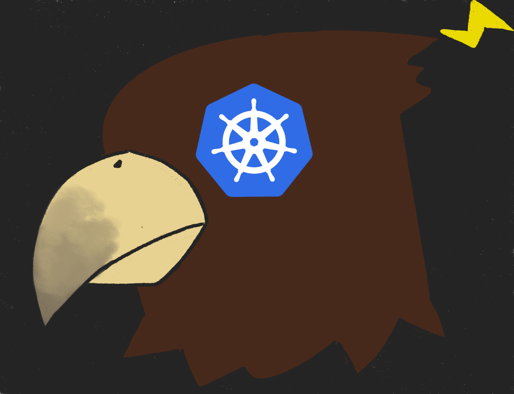
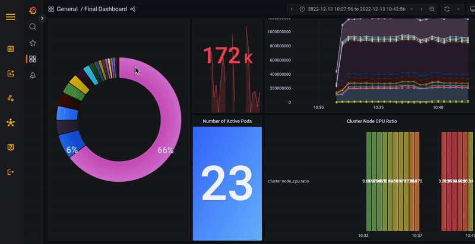
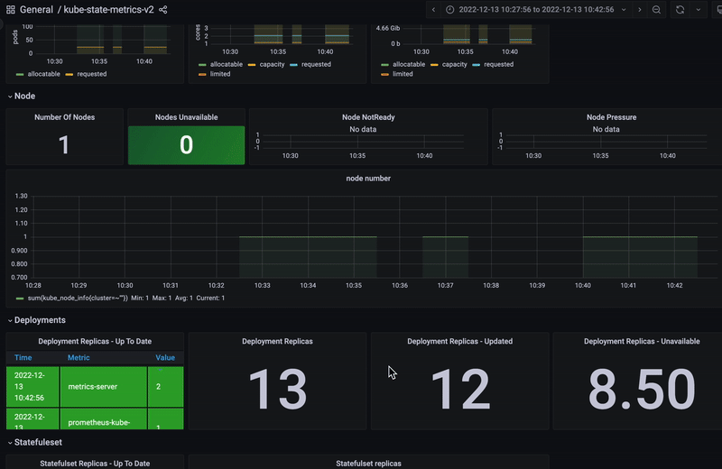

# ⚡ Zeus ⚡

<center> </center>


[](https://GitHub.com/Naereen/StrapDown.js/watchers/)

<br/>

# Supported OS


<br/>


<hr/>

# Features


<br/>


<br/>


<br/>


<br/>


<br/>


<br/>
<br/>

<p align="right">(<a href="#readme-top">back to top</a>)</p>

# Getting Started With Zeus


# Running Zeus

1. Fork and clone the `dev` branch onto your local branch.
   ``` bash
   https://github.com/oslabs-beta/Zeus.git
   ```

2. Install all the dependencies
   ``` bash 
      npm install 
   ```
3. Create ```process.env``` file at the root directory
   ``` bash
   root
      ├─ process.env
      ├─ electron
      └─ src
   ``` 
4. Connect to NoSQL database in .env

   ``` js
   mongoURI = "Your NoSQL URI string"
   ```
5. Ensure your cluster is running and then you can start the desktop application with:
   ``` bash
   npm run electron
   ```

</br>
<br/>

<p align="right">(<a href="#readme-top">back to top</a>)</p>

# Made with

<br>

### For Frontend Development


<br>

### For Backend Development


<br>

### For Monitoring and Data Visualizations


</br>
<br/>

<p align="right">(<a href="#readme-top">back to top</a>)</p>

# Contributions

For more information regarding how to contribute, please refer to the
[CONTRIBUTING.md](https://github.com/oslabs-beta/Zeus/blob/dev/CONTRIBUTING.md)
guidelines from this repo.

1. Fork and clone the `dev` branch onto your local branch.
   ``` bash
   https://github.com/oslabs-beta/Zeus.git
   ```
2. Create a new a feature branch
   ``` bash
   [your-name]/AWESOME-FEATURES
   ```
3. Install all the dependencies
   ``` bash 
      npm install 
   ```
4. Create ```process.env``` file at the root directory
   ``` bash
   root
      ├─ process.env
      ├─ electron
      └─ src
   ``` 
5. Connect to NoSQL database in .env

   ``` js
   mongoURI = "Your NoSQL URI string"
   ```
6. ***Please ensure you are following eslint conventions***.
7. ***Please ensure to create tests for your feature and that it passes your test suite***.
8. **Please be detailed in your pull request**.

   

</br>
<br/>

<p align="right">(<a href="#readme-top">back to top</a>)</p>

# Founders

- Harvey Li [LinkedIn](https://www.linkedin.com/in/harvey-li/) | [GitHub](https://github.com/harvli)
- Amy (Aimée) Nguyen [LinkedIn](https://www.linkedin.com/in/aqn/) | [GitHub](https://github.com/DoctorCodeine)
- John Wroge [LinkedIn](https://www.linkedin.com/in/john-wroge/) | [GitHub](https://github.com/johnwroge)
- Ed Cho [LinkedIn](https://www.linkedin.com/in/edcho720/) | [GitHub](https://github.com/edcho720)

</br>

<p align="right">(<a href="#readme-top">back to top</a>)</p>
