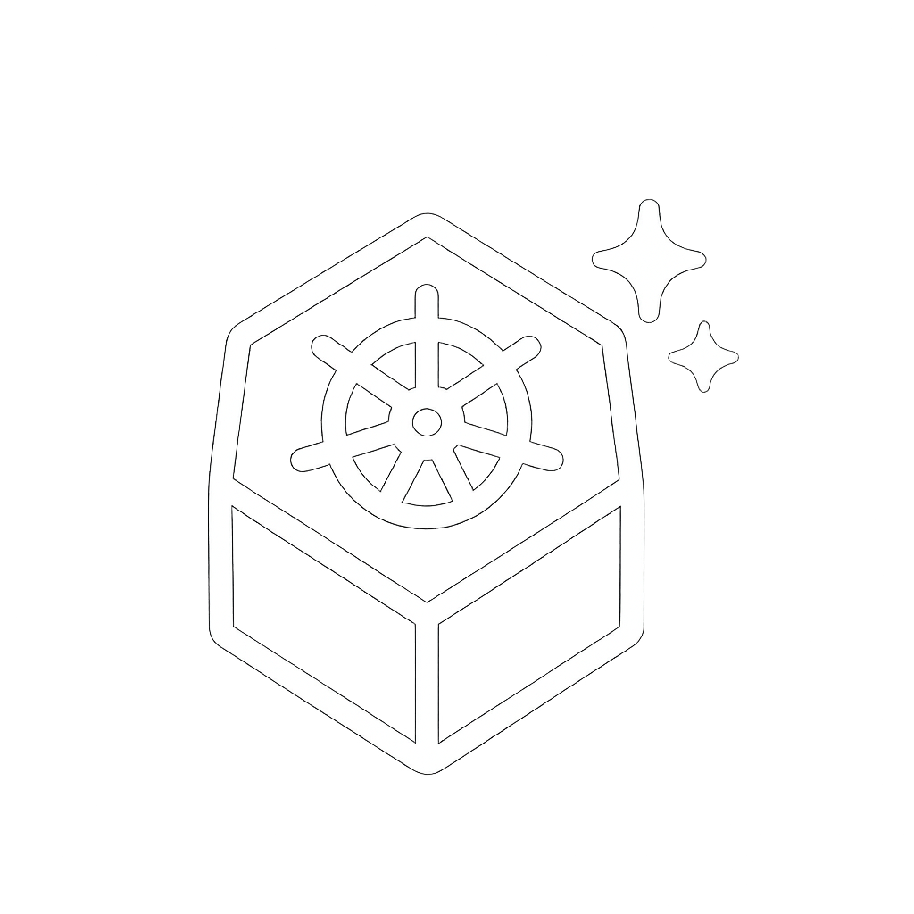
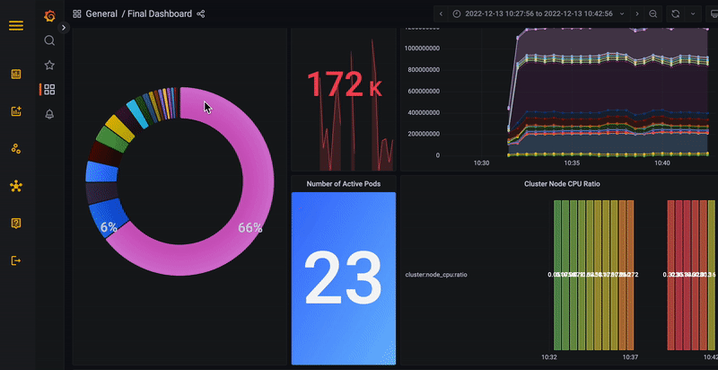
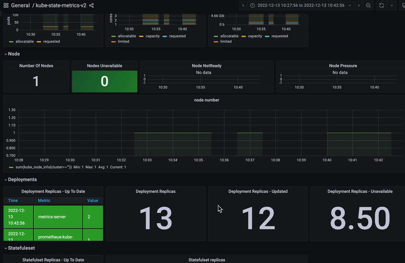

<div align="center">
  
  <h1>Kuberneat</h1>
  <p>A visualization and monitoring tool for Kubernetes clusters</p>

  [](https://opensource.org/licenses/MIT)
  [](https://github.com/oslabs-beta/Kuberneat)
  
  
  
  
  
  <h4>Supported Platforms</h4>
  <a href="https://github.com/oslabs-beta/Kuberneat"></a>
  <a href="https://github.com/oslabs-beta/Kuberneat"></a>
  <a href="https://github.com/oslabs-beta/Kuberneat"></a>

  <p>
    <a href="#overview">Overview</a> •
    <a href="#features">Features</a> •
    <a href="#getting-started">Getting Started</a> •
    <a href="#tech-stack">Tech Stack</a> •
    <a href="#contributing">Contributing</a> •
    <a href="#team">Team</a>
  </p>
</div>

## Overview

Kuberneat provides insights into Kubernetes environments through interactive visualizations. Originally released as Zeus in 2022, this project aims to offer a monitoring experience with Prometheus and Grafana integration. The project is currently in active development and welcomes community contributions.

<div align="center">
  
</div>

## Features

> **Note:** Kuberneat is under active development. The features shown below represent both current capabilities and development goals. Community contributions are welcome to help enhance these features.

<div align="center">
  <table>
    <tr>
      <td width="50%">
        <h3 align="center">Interactive Cluster Visualization</h3>
        
        <p align="center">Explore connections between Kubernetes resources with dynamic graph visualizations</p>
      </td>
      <td width="50%">
        <h3 align="center">Kubelet Metrics</h3>
        
        <p align="center">Monitor Kubelet performance metrics integrated from Prometheus</p>
      </td>
    </tr>
    <tr>
      <td width="50%">
        <h3 align="center">Kube-State-Metrics Integration</h3>
        
        <p align="center">Access comprehensive state metrics for cluster management</p>
      </td>
      <td width="50%">
        <h3 align="center">Kubernetes API Monitoring</h3>
        
        <p align="center">Track API server performance and request patterns</p>
      </td>
    </tr>
  </table>
</div>

## Getting Started

### Prerequisites

- Kubernetes cluster (local or remote)
- Prometheus and Grafana set up in your cluster
- Node.js 16+ and npm/yarn

### Development Setup

1. Clone the repository:
   ```bash
   git clone https://github.com/oslabs-beta/Kuberneat.git
   cd Kuberneat
   ```

2. Install dependencies:
   ```bash
   npm install
   ```

3. Create environment configuration:
   ```bash
   # Create a .env file in the root directory
   touch .env

   # Add your MongoDB connection string
   echo "mongoURI = \"Your NoSQL URI string\"" > .env
   ```

4. Launch the application in development mode:
   ```bash
   # For the web application
   npm run dev
   
   # For the Electron application
   npm run electron
   ```

> **Note:** This project is in development. You may encounter issues that require troubleshooting or configuration adjustments.

## Tech Stack

<details>
<summary>Frontend Technologies</summary>
<br>


</details>

<details>
<summary>Backend Technologies</summary>
<br>


</details>

<details>
<summary>Monitoring & Visualization Tools</summary>
<br>


</details>

## Contributing

We welcome contributions to help improve Kuberneat! Here's how you can help:

1. Fork the repository
2. Create a feature branch:
   ```bash
   git checkout -b your-name/awesome-feature
   ```
3. Make your changes and commit them:
   ```bash
   git commit -m 'Add some awesome feature'
   ```
4. Push to your branch:
   ```bash
   git push origin your-name/awesome-feature
   ```
5. Open a pull request with a detailed description of your changes

### Development Focus Areas

We're currently focusing on:
- Improving Prometheus/Grafana integration
- Enhancing D3.js visualizations
- Updating dependencies
- Expanding documentation
- Addressing compatibility issues

Please review our [Contribution Guidelines](https://github.com/oslabs-beta/Kuberneat/blob/dev/CONTRIBUTING.md) before submitting your PR.

<div align="center">
  
</div>

## Team

<div align="center">
  <table>
    <tr>
      <td align="center"><a href="https://github.com/harvli"><br /><sub><b>Harvey Li</b></sub></a><br /><a href="https://www.linkedin.com/in/harvey-li/">LinkedIn</a></td>
      <td align="center"><a href="https://github.com/TheNirmata"><br /><sub><b>Amy Nguyen</b></sub></a><br /><a href="https://www.linkedin.com/in/aqn/">LinkedIn</a></td>
      <td align="center"><a href="https://github.com/johnwroge"><br /><sub><b>John Wroge</b></sub></a><br /><a href="https://www.linkedin.com/in/john-wroge/">LinkedIn</a></td>
      <td align="center"><a href="https://github.com/edcho720"><br /><sub><b>Ed Cho</b></sub></a><br /><a href="https://www.linkedin.com/in/edcho720/">LinkedIn</a></td>
    </tr>
  </table>
</div>

## License

This project is licensed under the MIT License - see the [LICENSE](LICENSE) file for details.

<div align="center">
  <p>© 2025 Kuberneat • Originally released as Zeus in 2022</p>
  <a href="https://www.opensourcelabs.io/"></a>
</div>